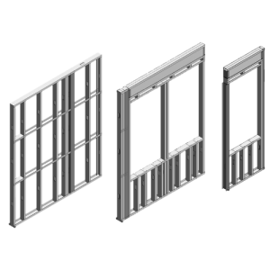

# CFS DESIGN FUNCTIONS 

<b>CFS Design Functions</b> consists of a simple python script containing several functions that can facilitate the design of typical load bearing wall panel cold formed steel members. 

Contents
===========
 * [Modules and Technologies Employed](#modules-and-technologies-employed)
 * [Design Capabilities](#design-capabilities)
 * [Functions](#functions)
 * [Installation and Use](#installation-and-use)

The objective of this repository is to provide design functions can be imported into any other python script or used directly in an excel file spreadsheet as User Defined Functions (UDF) with the help of modules such as [xlwings](https://github.com/xlwings/xlwings), allowing users to design more easily these type of members which can become complicated to design by hand. 

Aside from the manual itself, resources and examples related to the design of cold formed steel members are quite limited and typically very brief, not fully covering all possible design cases that can be present on typical cold formed steel members. This particular repository aims in providing as well another resource for structural engineers or any other curious mind with a simple algorithm that can be easily replicated and applied. The whole process can be read directly in the script and compared with the manuals standards published by the American Institute of Steel and Iron. 

### Modules and Technologies Employed:
The following modules were used in the development of this respository:
* <a href="https://github.com/connorferster/forallpeople" target="_blank">forallpeople</a>: Used for better unit management during the calculation process. 
* <a href="https://pypi.org/project/numpy/" target="_blank">numpy</a>: Used for simplification of some basic procedures when dealing with arrays.
* <a href="https://docs.python.org/3/library/csv.html" target="_blank">csv</a>: Used to manage csv files when reading the properties of codl formed steel structural sections
* <a href="https://docs.python.org/3/library/os.html" target="_blank">os</a>: Module used to determine the location of any external files needed for the module functions to work properly. 

### Design Capabilities:
The functions developed return different capacities under the typical limit states that can be found on cold formed steel elements. The calculated values that can be obtained are the following:

* Axial Strength
* Flexural Strength
* Shear Strength

These are the typical values that need to be obtained in order to design most structural elements, and should be sufficient to design typical members within a load bearing wall panel or as part of a floor system in a cold formed steel building/project.

**The design process and returned values only comply with the Allowable Stress Design (ASD) methodology for now. LRFD is pending for now.**

**Current calculations are done using the imperial system of units. The code can be easily adapted by any potential user for another unit system if required, since all calculations are done with the `forallpeople` module.**

## Functions:

At this point, the functions only work with specific shapes and sections. Currently only typical C-Sections with and without lips (stud and track sections) were considered in the calculation process in each function. These sections that can be used in the functions developed can be found in Table I-2 and Table I-3 in the AISI Cold Formed Steel Design Manual.

Since built up sections are also quite common, functions that can calculate the different limit state capacities of this type of elements were also included. Only back to back and boxed section configurations have been included so far in the repository.

Additionally, cold-work of forming is not included in any of the functions and calculations. This consideration will be implemented in future versions. As of now, results without considering cold-work as per AISI remain on the conservative side. 

Other configurations with three or more studs will be included in the future.

**The following functions are currently included in the module:**

* Axial Strength Capacity: 
    1. `getAxialStrength_Single()`:
    Returns the allowable axial strength of a single c-section stud **with** lips. Track sections currently are not available.
    2. `getAxialStrength_Boxed()`:
    Returns the allowable axial strength of a built up boxed c-section member **with** lips. Track sections currently are not available.
    3. `getAxialStrength_B2B()`:
    Returns the allowable axial strength of a built up back to back c-section member **with** lips. Track sections currently are not available.

* Bending Strength Capacity:
    1. `getFlexuralStrength_Single()`:
    Return the strong axis allowable bending moment of a single c-section member **with or without** lips. Track sections can only be used if unpunched.
    2. `getFlexuralStrength_Boxed()`: 
    Return the strong axis allowable bending moment of a built-up c-section boxed member **with or without** lips. Track sections can only be used if unpunched.
    3. `getFlexuralStrength_B2B()`:
    Return the strong axis allowable bending moment of a built-up c-section back to back member **with** lips. Track sections are not available.

* Bending Strength Capacity for Globally Braced Member:
    1. `getFlexuralStrength_Single_GB()`:
    Return the strong axis allowable bending moment of a globally braced single c-section member **with or without** lips. Track sections can only be used if unpunched.
    2. `getFlexuralStrength_Boxed_GB()`:
    Return the strong axis allowable bending moment of a globally braced built-up c-section boxed member **with** lips. Track sections can only be used if unpunched.
    3. `getFlexuralStrength_B2B_GB()`:
    Return the strong axis allowable bending moment of a globally braced built-up c-section back to back member **with** lips. Track sections are not available.
* Shear Strength Capacity:
    1. `getShearStrength_Single()`:
    Return the allowable shear strength of a single c-section member **with or without** lips. Track sections are available.
    2. `getShearStrength_BuiltUp()`:
    Return the allowable shear strength of a built up c-section member **with or without** lips. The section can be either boxed or built-up only. Track sections are available.

Additionally, functions to calculate the capacity of HSS members were added to the module. These were added due to how common their use is within the cold formed steel industry:

* HSS Axial Capacity:
    1. `getHSSAxialStrength()`:
    Returns the allowable axial strength of an HSS typical section. 
* HSS Flexural Capacity:

    2. `getHSSFlexuralStrength()`:
    Returns the allowable bending capacity of a typical HSS section.
* HSS Shear Capacity:

    3. `getHSSShearStrength()`:
    Returns the allowable shear strength of a typical HSS section.

Some calculation procedures were isolated as auxiliary functions to optimize the code and readability. The following additional functions can be found in the module being called inside several design functions:

* `calcEffectiveSectionModulus()`:
Returns the effective section modulus of a cold formed steel single member section, track or stud section. The calculation process is iterative and the amount of iterations can be adjusted inside the function. 
* `calulateEffectiveSectionModulus_B2B()`:
Returns the effective section modulus of a cold formed steel back to back built up section. The calculation process is iterative and can be ajdusted within the function. 

### Parameters and Variables Used:
The design functions include several parameters that at first glance might not be obvious. The following list explains each of the parameters that can be found in several or just some of module design functions:

1. `target_id`: (Type: string) Section name / ID according to the AISI standard. Must be a c-section (stud or track). Ex: '600S200-97' 
2. `section_type`: (Type: string) Section type to use, stud or track. Ex: 'stud'.
3. `L_stud`: (Type: float) Total length of the cold formed steel member in feet. 
4. `Fy`: (Type: float) Yield stress for design calculations in kips per square inch.
5. `S_bracing`: (Type: float) Weak axis axial bracing in cold formed steel member, in feet.
6. `F_bracing`: (Type: float) Weak axis flexural bracing in cold formed steel member, in feet
7. `E`: (Type: float) Elastic modulus of the member to be designed. Units in kips per square inch.
8. `G`: (Type: float) Shear modulus of the member to be designed. Units in kips.
9. `P_width`: (Type: float) Punchout width on stud member in inches.
10. `P_length`: (Type: float) Punchout length on stud member in inches.
11. `P_cond`: (Type: bool) Punchout condition in stud member, `True` or `False`.
12. `K_x`: (Type: float) Strong axis effective length factor, unitless
13. `K_y`: (Type: float) Weak axis effective length factor, unitless
14. `K_t`: (Type: float) Effective length factor fro twisting, unitless
15. `L_x`: (Type: float)
Strong axis unbraced length, feet.  
16. `L_y`: (Type: float) Weak axis unbraced length, feet.
17. `L_t`: (Type: float)
Unbraced length for twisting, feet
18. `Cb`: (Type: float) Bending coefficient dependent on moment gradient, unitless
19. `a`: (Type: float)
Interconnection spacing for built up sections (boxed and back to back), inches.
20. `dist_bracing`: (Type: bool) Distortional bracing status, `True` or `False`.
21. `L_dist_bracing`: (Type: float) Distortional bracing unbraced length, if bracing for this limit state is considered, feet.
22. `poiss`: (Type: float) Material poisson ratio, unitless. 
23. `hss_section`: (Type: string) HSS section for design and revision. Ex: 'HSS6X6X5/8'.
24. `orientation`: (Type: string) Orientation of structural member to be designed. Shall be 'strong' axis or 'weak' axis. Only applicable for HSS section design functions.

## Installation and Use:

No actual installation process is needed in this case. The script itself can be cloned or downloaded straight from the online repository an can be imported as a module in other Python scripts as needed. 

Since functions were originally developed to automate CFS design spreadsheets in Excel, they can also be used with [xlwings](https://github.com/xlwings/xlwings). These can be imported as UDF with the xlwings add-in directly in an excel file and can be run automatically like a native excel function within a spreadsheet. 

For use, the design functions simply need to be called into another script or into an excel spreadsheet. All functions rely on having the correct csv files to be able to obtain the corresponding properties of the selected section when running the function. 

The example file (`example_calcs.py`) contains a simple script showing how all functions can be called. Results are printed for user verification. 

